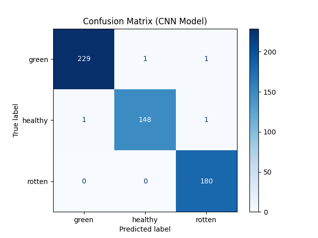
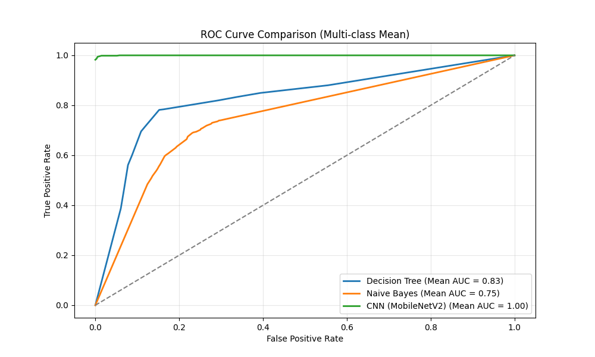

# 🥔 POTATO BELT: Automated Potato Quality Classification System


## 📖 Overview
**Potato Belt** is an end-to-end Computer Vision project designed to automate the sorting process of potatoes in industrial settings. Using Deep Learning (**MobileNetV2**), the system classifies potatoes into three categories with **99.29% accuracy**:

1.  **Healthy:** Fit for consumption.
2.  **Rotten:** Fungal defect, must be discarded.
3.  **Green:** Contains toxic **solanine**, strictly prohibited for consumption.

The project includes a **Real-time Simulation** (Pygame) connected to a **Flask API** serving the trained model, simulating a conveyor belt sorting mechanism.

---

## 🚀 Features
* **Deep Learning Model:** Transfer Learning using **MobileNetV2** pre-trained on ImageNet.
* **High Accuracy:** Achieved **99.29% accuracy**, significantly outperforming traditional ML methods.
* **Data Augmentation:** Handled severe class imbalance (specifically "Green" class) using rotation and flipping.
* **Real-Time Simulation:** A conveyor belt simulation built with **Pygame** to visualize the sorting process.
* **API Integration:** A Python **Flask** backend processes images and returns predictions to the simulation.

---

## 🛠️ Tech Stack
* **Language:** Python 3.x
* **Deep Learning:** TensorFlow, Keras (MobileNetV2)
* **Computer Vision:** OpenCV, Pillow (PIL)
* **Backend:** Flask (REST API)
* **Simulation:** Pygame
* **Data Analysis:** Pandas, NumPy, Matplotlib, Scikit-learn

---

## 💻 Installation & Usage

### 1. Clone the Repository
```bash
git clone [https://github.com/algobana/patates_project.git](https://github.com/algobana/patates_project.git)
cd patates_project
```

## 2. Install Dependencies
```bash
pip install -r requirements.txt
```

## 3. Run the Backend (API)
The Flask server loads the trained model and listens for image requests.
```bash
cd backend
python app.py
```
Server will start at http://localhost:5000


## 4. Run the Simulation
Open a new terminal window (keep the backend running) and start the Pygame simulation.
```bash
cd simulation
python sim_to_api.py
```

---

## 📊 Dataset & Preprocessing
The dataset was aggregated from **Roboflow Universe** and custom-collected samples.

* **Total Images:** ~3,800 (Balanced via augmentation).
* **Classes:** Green (~1,600), Healthy (~1,000), Rotten (~1,200).
* **Preprocessing:**
    * Resized to **160x160** pixels.
    * Normalized pixel intensities to **[-1, 1]** (MobileNetV2 standard).
    * **One-Hot Encoding** for target labels.

---


## 🧠 Model Performance
Three algorithms were benchmarked. The CNN model (MobileNetV2) demonstrated superior performance.

| Algorithm | Accuracy | Precision | Recall | F1-Score | ROC-AUC |
| :--- | :--- | :--- | :--- | :--- | :--- |
| **Decision Tree** | 0.7665 | 0.7705 | 0.7665 | 0.7674 | 0.77 |
| **Naive Bayes** | 0.6417 | 0.6607 | 0.6417 | 0.6442 | 0.72 |
| **CNN (MobileNetV2)** | **0.9929** | **0.9929** | **0.9929** | **0.9929** | **1.00** |

### Confusion Matrix
The model shows near-perfect classification with negligible error.


*(Please upload your confusion matrix image to the repo and link it here)*

---

## 📷 Screenshots

### Simulation Interface


### ROC Curve Analysis



---

## 👨‍💻 Author
**Berk AŞCI**
* **Project:** Data Mining Term Project
* **Date:** December 2025

---

## 📜 License
This project is open-source and available under the [MIT License](LICENSE).